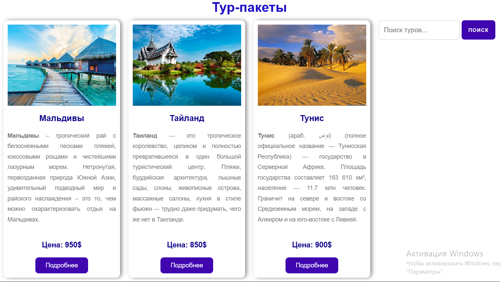
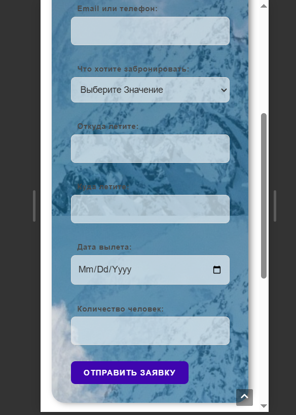
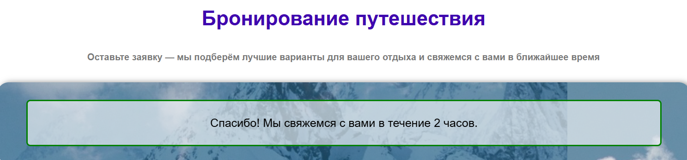
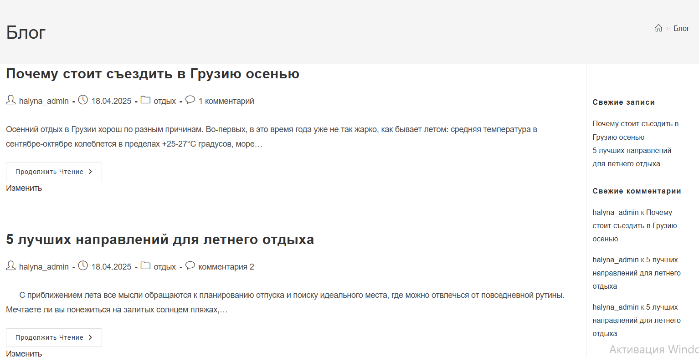
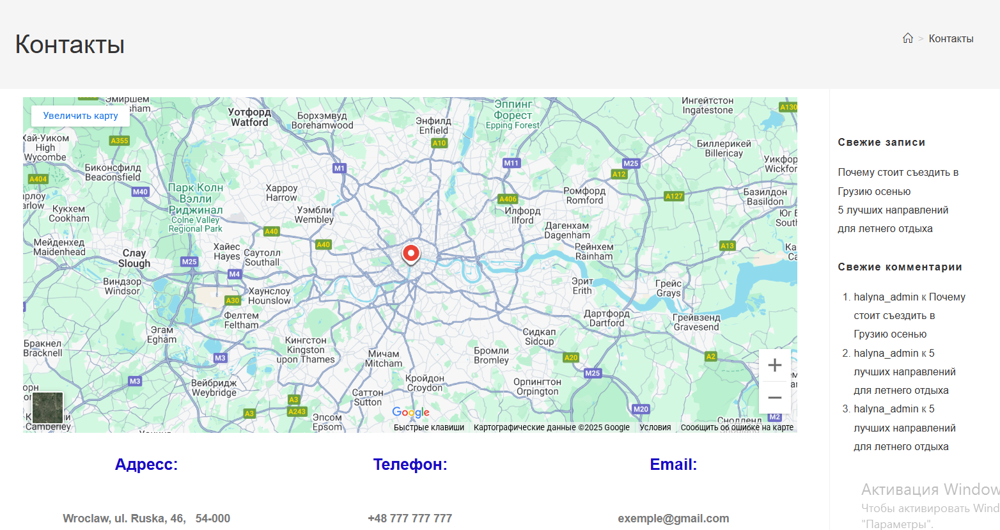

# 🌍 Туристический сайт на WordPress

Полноценный сайт туристического агентства с подбором туров, авиабилетов и проживания. Создан с нуля на WordPress + Elementor (free) без Elementor Pro.

[🔗 Живая версия сайта](https://halyna-tst.github.io/travel-agency-wordpress)  
*(если ты хочешь подключить GitHub Pages или залить демо на хостинг)*

---

## 📸 Скриншоты

| Главная | Тур-пакеты | Бронирование | Форма ответа | Новости | Контакты |
|--------|-------------|--------------|--------------|--------------|--------------|
|  |  |  |  |  |  |

---

## 🧰 Использованные технологии

- WordPress + OceanWP
- Elementor (бесплатная версия)
- HTML-формы без плагинов
- Кастомизация CSS
- Git + GitHub

---

## 🧩 Страницы сайта

- 🏠 Главная
- 📦 Тур-пакеты
- ✈ Авиабилеты
- 🏨 Проживание
- 📰 Новости
- 📍 Контакты
- 🧭 О нас
- 📋 Забронировать

---

## 💡 Что реализовано

- ✅ Адаптивная вёрстка
- ✅ Кастомные HTML-формы с JavaScript
- ✅ Карточки с отелями и турами
- ✅ Отдельные страницы под каждый отель
- ✅ Рабочие кнопки и маршруты
- ✅ Форма «Забронировать» с подтверждением
- ✅ Оптимизация под мобильные

---

## 🚀 Как запустить локально

1. Скопировать файлы в WordPress-директорию локального сервера (OSPanel, XAMPP)
2. Импортировать базу данных (если нужно)
3. Установить тему OceanWP и Elementor
4. Готово!

---
